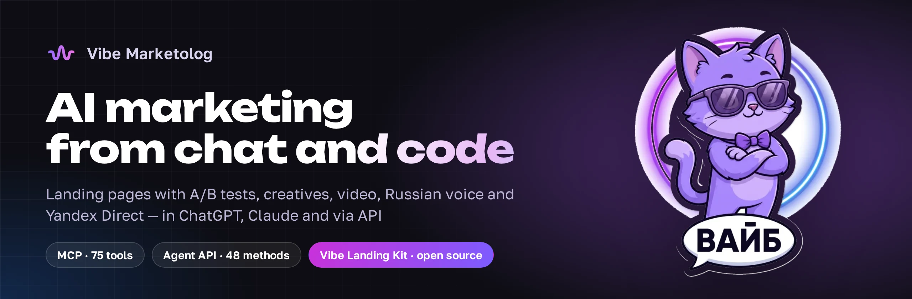
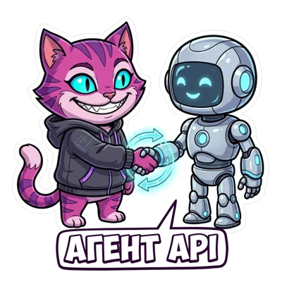

<div align="center">



**A Russian AI platform for marketing.** Landing pages with A/B tests, creatives, video, voice,
music, copy and Yandex Direct ads — in the dashboard, in ChatGPT and Claude, or from your code.

[](https://vibemarketolog.ru)
[](https://github.com/vibemarketologru/vibe-landing-kit)
[](https://vibemarketolog.ru/connect)
[](https://lk.vibemarketolog.ru/docs/agent-api)
[](https://telegram.me/vibemarketologru)

[Русский](README.md) · **English** · [中文](README.zh.md)

</div>

---

## Vibe Landing Kit — a tested hypothesis from one sentence

<a href="https://github.com/vibemarketologru/vibe-landing-kit"></a>

Tell an agent in ChatGPT, Claude or Claude Code what you sell and what you want to test.
It builds two page variants, checks them in a real browser, launches both on one address with
a 50/50 split, sends leads to Telegram and drafts Yandex Direct ads.

- **31 design systems** with Cyrillic fonts, **26 motion recipes**, **12 agent skills**.
- **Quality passport** — 18 checks in a real browser on desktop and four phone sizes, before you pay.
- **Honest A/B testing**: the sample plan is fixed at launch, the server calls the winner, sales per variant come from Bitrix24.
- **Yandex Direct under control**: draft and moderation with a safety lock; ads go live only after your explicit “yes”.

```text
/plugin marketplace add vibemarketologru/vibe-landing-kit
/plugin install vibe-landing@vibe-landing-kit
```

[Repository](https://github.com/vibemarketologru/vibe-landing-kit) ·
[product page and prices](https://vibemarketolog.ru/landing-kit) ·
[live examples](https://vibemarketolog.ru/landing-kit#examples)

## In ChatGPT and Claude — five minutes to connect


Paste the server address into ChatGPT settings (Plus, Pro, Business) or Claude (any plan,
including free), and **76 tools** appear right in the chat: landing pages and A/B tests,
Yandex Wordstat, Metrika and Direct, images, video and Russian voice.

```text
https://lk.vibemarketolog.ru/mcp
```

Sign-in through the dashboard with OAuth 2.1; paid actions show the price first and are
charged from a ruble balance. Video guides for every chat app:
[vibemarketolog.ru/connect](https://vibemarketolog.ru/connect).

<br clear="right">

## What the platform does

| Area | What it does |
|---|---|
| Landing pages and sites | A/B-tested landing pages with leads to Telegram, turnkey sites, custom domains |
| Images | Product and ad creatives, brand photos, AI retouching, presentations |
| Video | Text-to-video and photo-to-video, vertical Shorts and Reels, editing |
| Voice and music | Russian speech and multi-voice dialogue, voice cloning, tracks and jingles |
| Ads and analytics | Yandex Direct, Wordstat, Metrika, Audiences, Bitrix24 CRM |
| AI agents | Dashboard agent, AI sales assistant for websites and Telegram, scheduled tasks |

## Agent API — the platform as a tool for your agent



A public API designed so an AI agent can connect without a human: machine-readable schema,
price before charge, pay per operation.

| | |
|---|---|
| **Base** | `https://lk.vibemarketolog.ru/api/agent` |
| **Schema** | [OpenAPI 3.1](https://lk.vibemarketolog.ru/api/agent/openapi.json) — 48 operations, each with required scope, rate-limit group, error codes and a paid flag |
| **Catalog** | [`GET /capabilities`](https://lk.vibemarketolog.ru/api/agent/capabilities) — 66 models with parameters and prices: 29 image, 22 video, 8 voice, 4 music, 3 text |
| **Estimate** | `POST /estimate` — what an operation will cost. Free, before any charge |
| **SDK** | clients for Python, TypeScript and PHP — [details](https://vibemarketolog.ru/api) |

Billed in rubles per actual operation, no subscription. Every key has its own daily spend
cap. If a model fails on its side, the money is refunded automatically.

```bash
# Get a key in your account: https://lk.vibemarketolog.ru/agent
export VIBE_TOKEN="your_key"

# Check the key and its daily limit
curl -H "Authorization: Bearer $VIBE_TOKEN" https://lk.vibemarketolog.ru/api/agent/me

# Learn the price up front — free, nothing is charged
curl -X POST -H "Authorization: Bearer $VIBE_TOKEN" -H "Content-Type: application/json" \
     -d '{"type":"image","model":"nano-banana-2"}' \
     https://lk.vibemarketolog.ru/api/agent/estimate
```

[Full documentation](https://lk.vibemarketolog.ru/docs/agent-api) ·
[short quickstart for an agent's system prompt](https://lk.vibemarketolog.ru/docs/agent-quickstart)

<br clear="right">

## Links

| | |
|---|---|
| Platform | <https://vibemarketolog.ru> |
| Dashboard | <https://lk.vibemarketolog.ru> |
| Vibe Landing Kit | <https://github.com/vibemarketologru/vibe-landing-kit> |
| Connect to ChatGPT and Claude | <https://vibemarketolog.ru/connect> |
| API for developers | <https://vibemarketolog.ru/api> |
| Terms of use | <https://lk.vibemarketolog.ru/terms> |

## Author

**Vladimir Doretskiy** — founder of Vibe Marketolog, Saint Petersburg.

Telegram: [@CentrMedia](https://telegram.me/CentrMedia) · Project channel:
[@vibemarketologru](https://telegram.me/vibemarketologru) · Email: ceo@vibemarketolog.ru

---

<div align="center">
<sub>

Embedding the platform into your own product is allowed. Reselling API access as a
standalone service is not; see sections 19–20 of the
<a href="https://lk.vibemarketolog.ru/terms">terms of use</a>.

</sub>
</div>
