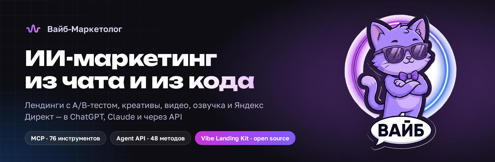
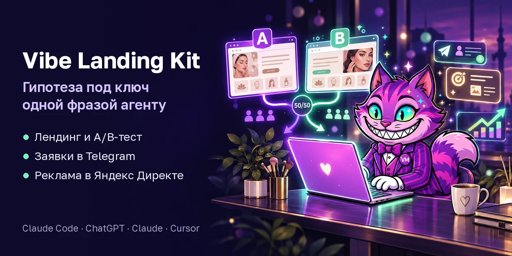
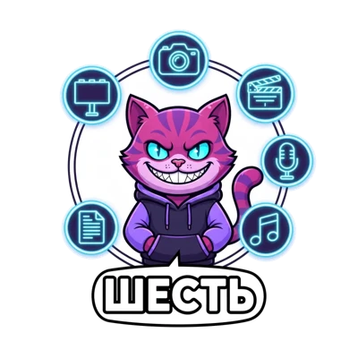

<div align="center">



**Российская ИИ-платформа для маркетинга.** Лендинги с A/B-тестом, креативы, видео, озвучка,
музыка, тексты и реклама в Яндекс Директе — в кабинете, в ChatGPT и Claude или из вашего кода.

[](https://vibemarketolog.ru)
[](https://github.com/vibemarketologru/vibe-landing-kit)
[](https://vibemarketolog.ru/connect)
[](https://lk.vibemarketolog.ru/docs/agent-api)
[](https://telegram.me/vibemarketologru)

**Русский** · [English](README.en.md) · [中文](README.zh.md)

</div>

---

## Vibe Landing Kit — гипотеза под ключ одной фразой

<a href="https://github.com/vibemarketologru/vibe-landing-kit"></a>

Напишите агенту в ChatGPT, Claude или Claude Code, что продаёте и что хотите проверить.
Он соберёт два варианта страницы, проверит их в настоящем браузере, запустит на одном адресе
с делением трафика 50/50, пришлёт заявки в Telegram и подготовит рекламу в Яндекс Директе.

- **31 дизайн-система** с кириллическими шрифтами, **26 анимаций**, **12 навыков** для агента.
- **Паспорт качества** — 18 проверок в браузере на компьютере и четырёх размерах телефона, до оплаты.
- **Честный A/B-тест**: план выборки закрепляется при запуске, победителя объявляет сервер, продажи по вариантам — из Битрикс24.
- **Директ под контролем**: черновик и модерация с предохранителем, показы — только после вашего «да».

```text
/plugin marketplace add vibemarketologru/vibe-landing-kit
/plugin install vibe-landing@vibe-landing-kit
```

[Репозиторий](https://github.com/vibemarketologru/vibe-landing-kit) ·
[страница набора и цены](https://vibemarketolog.ru/landing-kit) ·
[живые примеры](https://vibemarketolog.ru/landing-kit#examples)

## В ChatGPT и Claude — подключение за пять минут



Вставьте адрес сервера в настройках ChatGPT (Plus, Pro, Business) или Claude (любой тариф,
включая бесплатный) — и **76 инструментов** платформы появятся прямо в чате:
лендинги и A/B-тесты, Вордстат, Метрика, Яндекс Директ, картинки, видео и русская озвучка.

```text
https://lk.vibemarketolog.ru/mcp
```

Вход — через кабинет по OAuth 2.1, оплата с рублёвого баланса за сделанное, цена
называется до списания. Видеоинструкции для каждого чата — на странице
[vibemarketolog.ru/connect](https://vibemarketolog.ru/connect). Нет ChatGPT или Claude —
[три способа начать](https://vibemarketolog.ru/landing-kit#start).

<br clear="right">

## Что умеет платформа

| Направление | Что делает |
|---|---|
| Лендинги и сайты | Лендинги с A/B-тестом и заявками в Telegram, сайты под ключ, свой домен |
| Изображения | Товарные и рекламные креативы, бренд-фото, нейроредактура, презентации |
| Видео | Ролики из текста и из фото, вертикальный формат под Shorts и Reels, монтаж |
| Озвучка и музыка | Русская речь и диалоги на несколько голосов, клон голоса, треки и джинглы |
| Реклама и аналитика | Яндекс Директ, Вордстат, Метрика, Аудитории, CRM Битрикс24 |
| ИИ-агенты | Агент в кабинете, консультант с ИИ для сайта и Telegram, регулярные задачи |

## Agent API — платформа как инструмент для вашего агента


Публичное API, спроектированное так, чтобы ИИ-агент подключался к нему без человека:
машинная схема, цена до списания, оплата за операцию.

| | |
|---|---|
| **База** | `https://lk.vibemarketolog.ru/api/agent` |
| **Схема** | [OpenAPI 3.1](https://lk.vibemarketolog.ru/api/agent/openapi.json) — 48 методов; у каждой операции указаны право доступа, лимит частоты, коды ошибок и платность |
| **Каталог** | [`GET /capabilities`](https://lk.vibemarketolog.ru/api/agent/capabilities) — 66 моделей с параметрами и ценами: 29 для изображений, 22 для видео, 8 для озвучки, 4 для музыки, 3 текстовые |
| **Смета** | `POST /estimate` — сколько будет стоить операция. Бесплатно и до списания |
| **SDK** | клиенты для Python, TypeScript и PHP — [подробности](https://vibemarketolog.ru/api) |

Оплата в рублях, за фактическую операцию, без подписки. У каждого ключа свой суточный
потолок расхода. При сбое на стороне модели деньги возвращаются автоматически.

```bash
# Ключ — в кабинете: https://lk.vibemarketolog.ru/agent
export VIBE_TOKEN="ваш_ключ"

# Проверить ключ и суточный лимит
curl -H "Authorization: Bearer $VIBE_TOKEN" https://lk.vibemarketolog.ru/api/agent/me

# Узнать цену заранее — бесплатно, ничего не спишется
curl -X POST -H "Authorization: Bearer $VIBE_TOKEN" -H "Content-Type: application/json" \
     -d '{"type":"image","model":"nano-banana-2"}' \
     https://lk.vibemarketolog.ru/api/agent/estimate
```

[Полная документация](https://lk.vibemarketolog.ru/docs/agent-api) ·
[короткий квикстарт для системного промпта агента](https://lk.vibemarketolog.ru/docs/agent-quickstart)

<br clear="right">

## Некогда разбираться — готовый агент

**Вайб Профессиональный** — ИИ-сотрудник с рекламными навыками в Telegram: лендинги,
кампании, креативы и отчёты. ChatGPT и Claude не нужны, ставим за 24 часа, цена фиксированная.
[Тарифы и возможности](https://vibemarketolog.ru/agents)

## Ссылки

| | |
|---|---|
| Платформа | <https://vibemarketolog.ru> |
| Личный кабинет | <https://lk.vibemarketolog.ru> |
| Vibe Landing Kit | <https://github.com/vibemarketologru/vibe-landing-kit> |
| Подключение к ChatGPT и Claude | <https://vibemarketolog.ru/connect> |
| API для разработчиков | <https://vibemarketolog.ru/api> |
| Академия и разборы | <https://vibemarketolog.ru/academy> |
| Условия использования | <https://lk.vibemarketolog.ru/terms> |

## Автор

**Владимир Дорецкий** — основатель Вайб-Маркетолога, Санкт-Петербург.

Telegram: [@CentrMedia](https://telegram.me/CentrMedia) · Канал проекта:
[@vibemarketologru](https://telegram.me/vibemarketologru) · Почта: ceo@vibemarketolog.ru

---

<div align="center">
<sub>

Встраивание платформы в свой продукт разрешено. Перепродажа доступа к API как
самостоятельной услуги — нет; условия в разделах 19–20
<a href="https://lk.vibemarketolog.ru/terms">оферты</a>.

</sub>
</div>

<!-- профиль Вайб-Маркетолога -->
